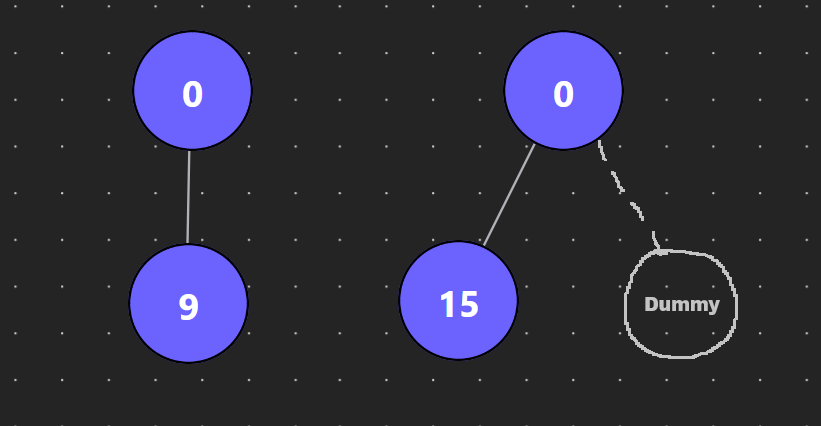
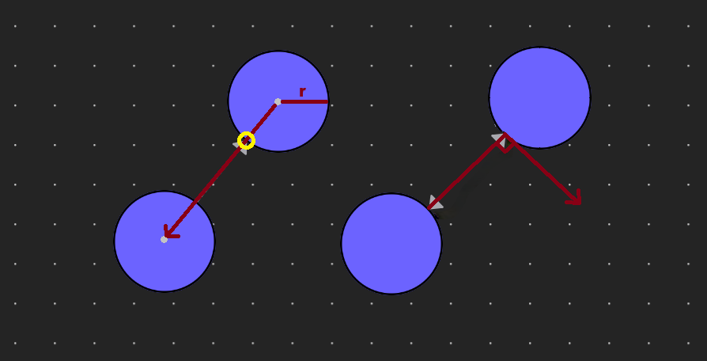

# Data Structure Visualizer

Allows the user to construct a binary tree and change values.

_Project goal: A "Swiss Army knife" for students and educators to easily create diagrams and problem inputs (e.g. leetcode) for common data structures, notably trees and graphs._

## Table of Contents
- [Features](#features)
- [Roadmap](#roadmap)
- [Tech](#tech)
- [Installation](#run-locally)
- [Style Guide](#style)
- [Docs](#docs)
  - [Project Structure](#project-structure)
  - [Layout System](#layouting)
  - [State Management](#state-management)
- [License](#license)

## Features
- Binary Tree
  - Modify node values
  - Node deletion and pruning branches
  - Undo-redo
  - Convert back and forth between tree and leetcode string
- Graph
  - Modify node values
  - Supports both directed/undirected graphs
  - Toggleable weight labels
  - `Space` to toggle between moving nodes and drawing edges

## Roadmap

- Introduction to explain usage and controls
- Graph serialization
- Layout/visual settings
- Visualize traversal algorithms

## Tech

- [React TypeScript]() - Frontend
- [React Flow]() - Node based library
- [React Router]() - Enables pagination
- [Zustand]() - State management + Local storage persistence

### Other dependencies

- [d3-hierarchy]() - Layouting library for tree-like structures
- [clsx]() - Enables construction of conditional `className` strings
- [zundo]() - Middleware provides support for temporal state management (undo/redo)
- [react-hotkeys-hook]() - Enables hotkey listening

## Run Locally

Clone the project

```bash
  git clone git@github.com:arthur-schevey/ds-visualizer.git
```

Go to the project directory

```bash
  cd ds-visualizer
```

Install dependencies

```bash
  npm install
```

Start the server

```bash
  npm run dev
```

## Style

- ESLint to enforce code quality with eslint-plugin-only-warn to reduce noise/false alarms
- _Optional: prettier with default config_

## Docs
### Project Structure
*This is still in early development and the structure is subject to change.*

That being said, as with most React applications, the entry point of the program is `main.tsx` which renders `App.tsx`—our router. 

The router has a top-level `Layout.tsx` file which describes shared visuals like the navigation bar and floating footer. It contains an outlet for our router to inject either the `TreeFlow` or `GraphFlow` component which are the hearts of their respective app.

From there, each app (or feature) has its own folder to serve as its domain consisting of some variation of the following ideas:
- **store**: Contains the app data, initialization of that data, important constants, and middleware (e.g. `devtools`, `persist` or `zundo`).
- **api**: Contains actions that act on their respective store that are globally accessible
- **utils**
- **types**
- **components**

### Layouting
#### Binary Tree Layout
By default, `d3-hierarchy` lays out a lone child directly below the parent as seen in the left tree. In order to circumvent this behavior to look more like a binary tree, we must give each node *without* a sibling a "dummy" sibling during the layouting procedure. Leaf nodes must not have any dummy children to prevent "spreading" out the tree.



Additionally, d3-hierarchy will order children as they are recieved, so it is important to distinguish a lone left child from a lone right child by placing the dummy node accordingly.

#### Graph Layout
Not yet implemented. The layout will be decided by the user. There may be an option to use d3-force or other d3 layouts once implemented.

Regarding edge creation, we needed something slightly more sophisticated than trees to draw connections, show an arrow, and most importantly visually distinguish bidirectional edges.

1. Drawing connections/edges (left side of image): An edge between circles is best described by a line from the two closest points of two circles. To get these closest points, we need to calculate the unit vector from some source position to a target and march the source position `r` units along the vector. Additionally, this needs to be repeated from the opposite direction.
2. Offsetting bidirectional edges (right side of image): To avoid edges stacking on top of each other, we need to move the points perpendicular `distance` units. To do this, we first rotate the vector of each line 90°, calculate the unit vector, then march each point `distance` units. 



### State Management
Uses Zustand for state management. Each app within the project should have its own store independent of other apps. 

We create a helper for each store called `use<AppName>Store` for the purpose of chaining middleware like `persist` for local storage persistence, `devtools` for use with Redux devtools browser extension, and `temporal` for enabling undo/redo. Otherwise, all store logic and initialization will be found in `create<AppName>Store`.

When using the store, all we need is `const state = useTreeStore()`. However, in most cases, we'll want a `selector` to subscribe to desired parts of the store to prevent unnecessary rerenders. Additionally, it's important to use `useShallow(selector)` if the selector returns an object (which it almost always does) to prevent excessive rerenders and weird behavior.

### Graph
#### Directed/Undirected
**In short**: The graph internally is directed, when the user switches to undirected it is just a directed graph that disallows counterdirectional edges (two nodes can't have two edges).

The differences between the two modes can found in the following table:
| Feature              | Directed   | Undirected
| :------------------- | :--------- | :-----------
| Add `A->B` to `A B`  | Add        | Add
| Add `A->B` to `A->B` | Ignore     | Ignore
| Add `B->A` to `A->B` | Add        | Ignore
| Weight               | As normal  | As normal
| Offset double edge   | As normal  | As normal (can't have double edge)
| Arrow Marker         | Display    | Hide
| Switch mode to...    | Do nothing | Drop an edge if double edge (loses information)

*What this means* is that any undirected graph logic using the graph state (such as serialization or traversals) must coerce the directed graph into an undirected one. In other words, an edge `A->B` needs to be inferred as `A<->B`

## License

[GPLv3](https://choosealicense.com/licenses/gpl-3.0/)
